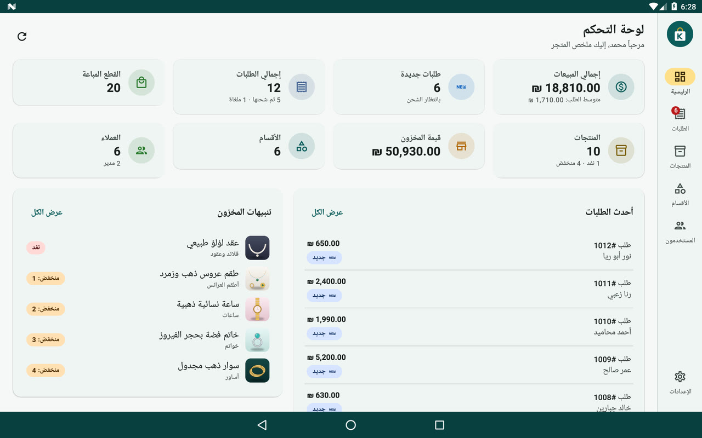
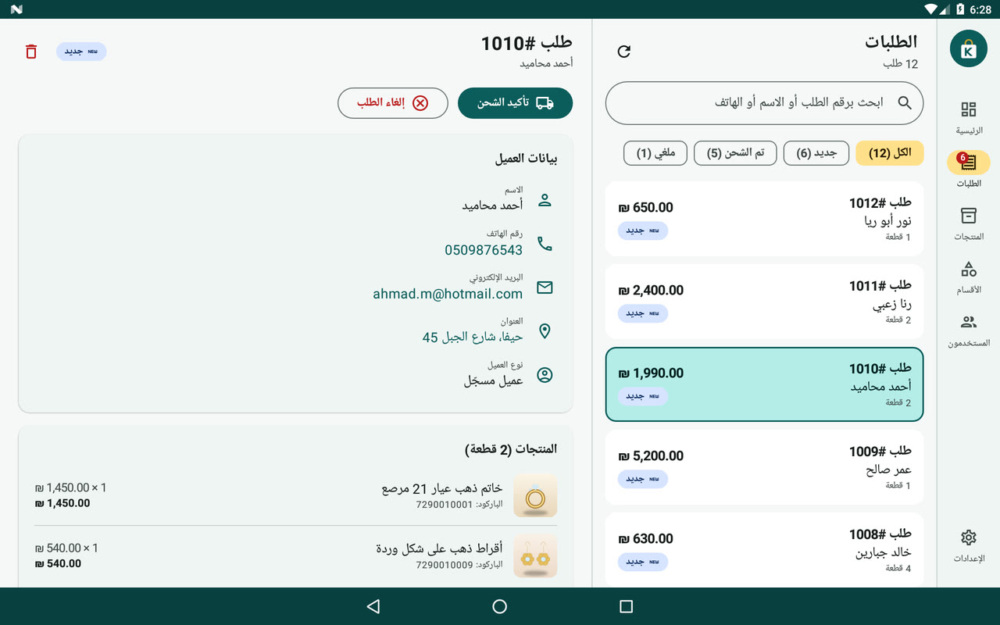
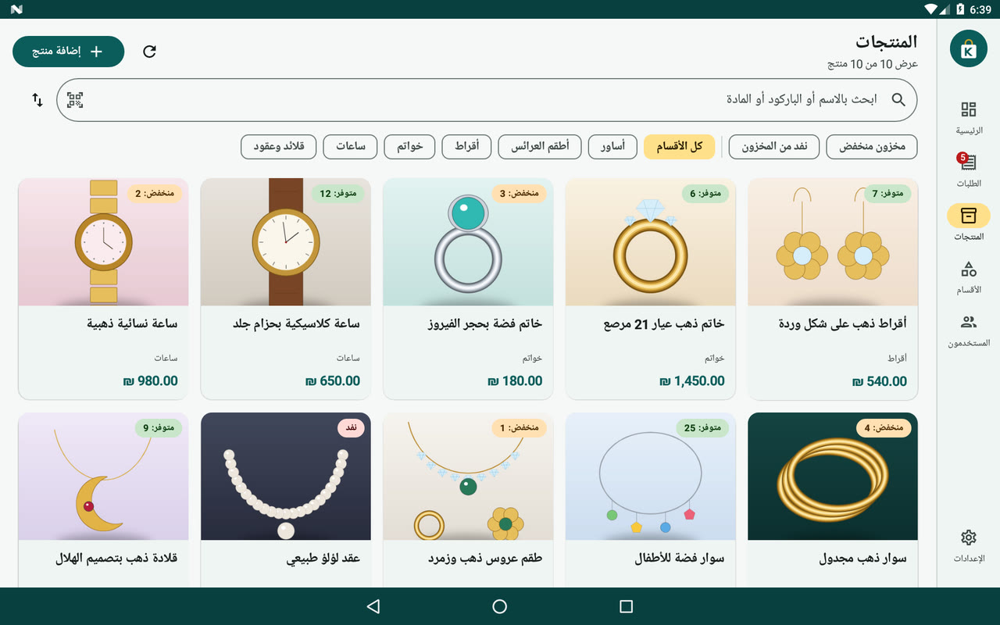
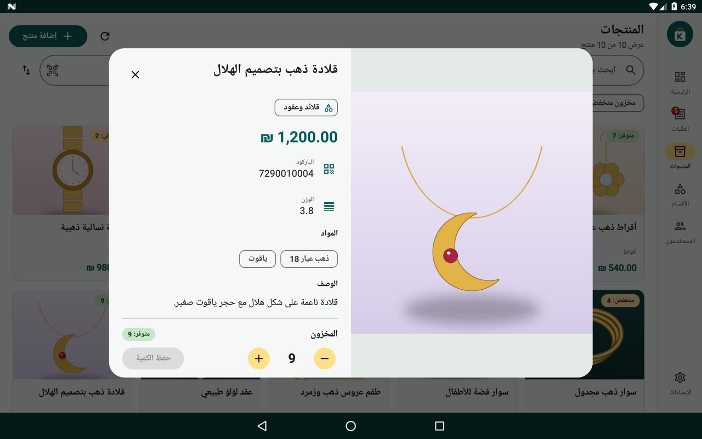
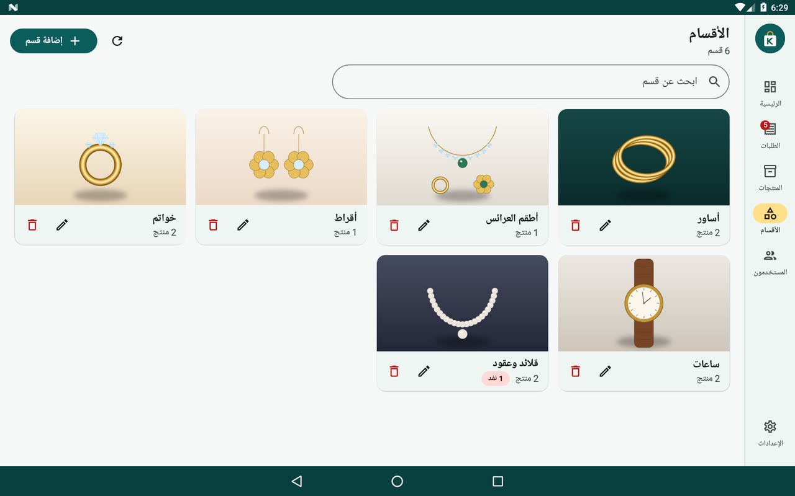
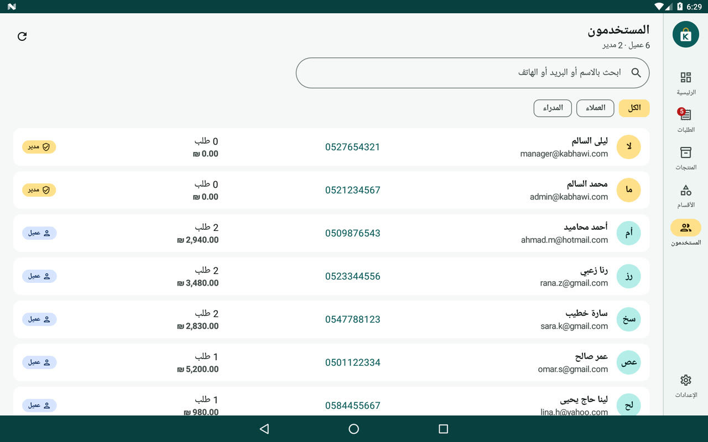

# KabhawiMS Admin — تطبيق أندرويد لإدارة المتجر

تطبيق أندرويد (Kotlin + Jetpack Compose) لإدارة متجر KabhawiMS الإلكتروني عبر الـ API الخاص به،
مصمَّم لشاشات **التابلت** ويعمل على **Android 7.0 (API 24)** وما فوق، بواجهة عربية من اليمين إلى اليسار.

## لقطات من التطبيق

فيديو جولة كاملة في الواجهة (مسجّل على محاكي تابلت Android 7.0 مع بيانات تجريبية):
[docs/media/kabhawi-admin-demo.mp4](docs/media/kabhawi-admin-demo.mp4)

| لوحة التحكم | الطلبات |
|---|---|
|  |  |
| **المنتجات** | **تفاصيل منتج** |
|  |  |
| **الأقسام** | **المستخدمون** |
|  |  |

> البيانات والصور في اللقطات تجريبية من `demo/mock_server.py`. لإعادة التسجيل شغّل
> workflow **Android Admin Demo Video** من تبويب Actions.

## المزايا

| الشاشة | ما يمكن فعله |
|---|---|
| **لوحة التحكم** | إجمالي المبيعات، الطلبات الجديدة، القطع المباعة، قيمة المخزون، عدد العملاء، أحدث الطلبات، تنبيهات المخزون المنخفض، الطلبات حسب الحالة، الأكثر مبيعاً |
| **الطلبات** | قائمة + تفاصيل جنباً إلى جنب على التابلت، بحث برقم الطلب/الاسم/الهاتف/البريد، فلترة حسب الحالة، تأكيد الشحن، إلغاء الطلب، إعادة التفعيل، الحذف، الاتصال بالعميل أو مراسلته أو فتح عنوانه على الخريطة |
| **المنتجات** | شبكة منتجات بالصور، بحث، فلترة حسب القسم والمخزون، ترتيب، إضافة/تعديل/حذف، رفع عدة صور (مع تصغير تلقائي قبل الرفع)، تعديل سريع للكمية، **مسح الباركود بالكاميرا** للبحث عن منتج أو إضافته |
| **الأقسام** | إضافة/تعديل/حذف قسم مع صورته، عدد المنتجات في كل قسم، الانتقال لمنتجات القسم |
| **المستخدمون** | كل الحسابات مع الدور (مدير/عميل)، عدد الطلبات وإجمالي مشتريات كل عميل |
| **الإعدادات** | معلومات الحساب ووقت انتهاء الجلسة، اختبار الاتصال، رمز العملة، حد المخزون المنخفض، تسجيل الخروج |

- تخطيط متجاوب: شريط تنقل جانبي (Navigation Rail) على التابلت وشريط سفلي على الشاشات الصغيرة.
- يدعم الوضع الأفقي والعمودي والوضع الليلي.
- الأرقام تُعرض بأرقام لاتينية دائماً، ويمكن إدخال الأرقام العربية (٠١٢٣…) في الحقول.

## المتطلبات

- Android Studio (إصدار Ladybug 2024.2 أو أحدث) مع JDK 17 (المرفق مع Android Studio يكفي).
- خدمات KabhawiMS تعمل (`docker compose up`)، والـ Gateway متاح على المنفذ `8080`.
- حساب بصلاحية **ADMIN** (انظر الفقرة التالية).

## إنشاء حساب مدير

خدمة AuthForge تُنشئ كل الحسابات الجديدة بدور `USER`، ولا يوجد API لترقية حساب إلى مدير.
سجّل حساباً عادياً (من المتجر أو عبر `POST /signUp`) ثم غيّر دوره من قاعدة بيانات المستخدمين
(مثلاً عبر pgAdmin على المنفذ `5050`، قاعدة `user`):

```sql
UPDATE users SET role = 'ADMIN' WHERE username = 'admin@example.com';
```

> التطبيق يرفض تسجيل الدخول لأي حساب ليس دوره `ADMIN`.

## التشغيل من Android Studio

1. افتح مجلد `KabhawiAdmin-Android` (وليس جذر المستودع) من **File ▸ Open**.
2. انتظر انتهاء Gradle Sync.
3. وصّل التابلت (مع تفعيل USB debugging) واضغط **Run ▶**.

## بناء ملف APK وتثبيته على التابلت

```bash
cd KabhawiAdmin-Android
./gradlew assembleRelease
# الملف الناتج:
# app/build/outputs/apk/release/app-release.apk
```

أو حمّل الملف الجاهز من **GitHub ▸ Actions ▸ Android Admin App ▸ Artifacts (kabhawi-admin-apk)**،
حيث يُبنى التطبيق وتُشغَّل الاختبارات تلقائياً مع كل تعديل على هذا المجلد.

للتثبيت: انسخ الملف إلى التابلت، وفعّل «مصادر غير معروفة» من الإعدادات ▸ الأمان، ثم افتحه.
يُنصح بنسخة **release** لأنها أسرع بكثير على أجهزة Android 7 القديمة.

> نسخة release موقّعة بمفتاح debug لتكون قابلة للتثبيت مباشرة. عند التحديث بنسخة بُنيت على جهاز آخر
> قد تحتاج لإلغاء تثبيت النسخة القديمة أولاً. للنشر على Google Play أنشئ مفتاح توقيع خاصاً
> (**Build ▸ Generate Signed App Bundle / APK**) واستبدل `signingConfig` في `app/build.gradle.kts`.

## الاتصال بالخادم

في شاشة الدخول أدخل عنوان الـ Gateway، ثم اضغط «اختبار الاتصال»:

| الحالة | العنوان |
|---|---|
| الخادم على نفس شبكة الـ WiFi | `http://192.168.1.10:8080` (عنوان IP لجهاز الخادم) |
| محاكي Android Studio والخادم على نفس الكمبيوتر | `http://10.0.2.2:8080` |
| خادم على الإنترنت | `https://api.example.com` |

- الاتصال عبر `http` مسموح (للشبكات المحلية، ولأن Cloudinary يعيد روابط صور `http`).
- **ملاحظة Android 7:** الإصدار 7.0 لا يثق افتراضياً بشهادات Let's Encrypt الحديثة، لذلك
  شهادتا ISRG Root X1/X2 مضمّنتان في التطبيق (`res/xml/network_security_config.xml`) ليعمل `https` بدون مشاكل.

## الـ API المستخدم (عبر الـ Gateway)

| الوظيفة | الطلب |
|---|---|
| تسجيل الدخول | `POST /login` ← يعيد JWT كنص |
| بيانات المستخدم من التوكن | `GET /parse-token` (ترويسة `Authorization` = التوكن بدون `Bearer`) |
| المستخدمون | `GET /getAllUsers` |
| المنتجات | `GET /api/product/getAllProducts` |
| إضافة/تعديل منتج | `POST /api/product/addProduct` ، `PUT /api/product/updateProduct/{barcode}` (multipart: `product` JSON + `images`) |
| حذف منتج | `DELETE /api/product/deleteProduct/{barcode}` |
| الأقسام | `GET /api/product/getCategories` |
| إضافة/تعديل قسم | `POST /api/product/addCategory` ، `PUT /api/product/updateCategory/{name}` (multipart: `category` JSON + `image`) |
| حذف قسم | `DELETE /api/product/deleteCategory/{name}` |
| الطلبات | `GET /api/order/getOrders` |
| تغيير حالة طلب | `PUT /api/order/{id}/status?status=CREATED\|SHIPPED\|CANCELLED` |
| حذف طلب | `DELETE /api/order/{id}` |

### سلوكيات في الخادم يتعامل معها التطبيق

- `getAllProducts` لا يعيد `categoryId` (لا يربطه MapStruct)، فيستنتج التطبيق قسم كل منتج من `getCategories`.
- رفع صور جديدة لمنتج **يستبدل** كل صوره القديمة، ولا يمكن حذف كل الصور عبر الـ API (يبقى صورة واحدة على الأقل).
- إنشاء قسم يتطلب صورة (العمود `imageUrl` غير قابل لأن يكون فارغاً).
- حذف قسم يحذف كل منتجاته (`CascadeType.REMOVE`) — التطبيق يحذّر من ذلك قبل الحذف.
- تعديل قسم يحوّل اسمه إلى أحرف كبيرة (للأسماء اللاتينية).
- تكرار الباركود أو اسم المنتج يعيد خطأ 500 من الخادم، لذلك يتحقق التطبيق منه قبل الإرسال.
- التوكن صالح لساعة واحدة (`jwt.expiration.millis`)، وبعدها يُطلب تسجيل الدخول عند العودة للتطبيق.

## ملاحظة أمنية مهمة

الـ Gateway يسمح حالياً بكل الطلبات (`permitAll`)، ونقاط الإدارة (إضافة/حذف المنتجات، الطلبات، `getAllUsers`)
**لا تتحقق من التوكن ولا من الدور في الخادم**. التطبيق يرسل التوكن في ترويسة `Authorization` مع كل طلب
ويتحقق من دور `ADMIN` عند الدخول، لكن الحماية الحقيقية يجب أن تكون في الخادم: يُنصح بإضافة فلتر في
GateWay-server يتحقق من التوكن عبر `/parse-token` ويشترط `role = ADMIN` لمسارات الإدارة.

## هيكل المشروع

```
app/src/main/java/com/kabhawi/admin/
├── data/
│   ├── model/Models.kt          نماذج مطابقة لـ DTO الخادم
│   ├── remote/                  Retrofit API، إعداد JSON، رسائل الأخطاء
│   ├── StoreRepository.kt       مصدر البيانات الوحيد (StateFlow) + رفع multipart
│   ├── SessionManager.kt        الجلسة والإعدادات (SharedPreferences)
│   ├── Catalog.kt               ربط المنتجات بالأقسام
│   ├── DashboardStats.kt        حساب الإحصائيات
│   └── ImageCompressor.kt       تصغير الصور وتصحيح اتجاهها قبل الرفع
├── ui/
│   ├── login/ dashboard/ orders/ products/ categories/ users/ settings/
│   ├── components/              مكونات مشتركة (بطاقات، حالات، صور، ماسح الباركود)
│   └── theme/                   الألوان والخطوط (Material 3)
└── MainActivity.kt
```

المكتبات: Jetpack Compose (Material 3)، Retrofit + OkHttp، kotlinx.serialization، Coil (الصور)،
ZXing (مسح الباركود بدون Google Play Services).

## الاختبارات

```bash
./gradlew testDebugUnitTest
```

تشمل اختبارات لتنسيق الأرقام، حساب الإحصائيات، الفلاتر، قراءة JSON الخادم،
والتحقق من أن طلبات Retrofit (المسارات وأجزاء multipart والترويسات) تطابق وحدات التحكم في الخادم.
